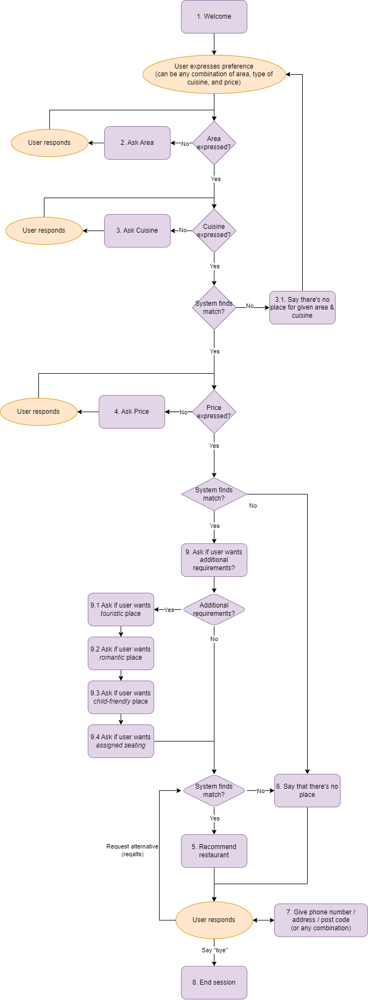

# MAIR-G8

## Intent detection

This project consists of the following baseline systems for intent detection:

- A baseline system that, regardless of the content of the utterance, always assigns the majority class of in the data. (`baseline_majority.py`)
- A baseline rule-based system based on keyword matching. (`baseline_keyword_matcher.py`)

As well as three different machine learning classifiers for intent detection:

- kNN (`knn.py`)
- Logistic regression (`logreg.py`)
- Linear SVC (`lsvc.py`)

The table below shows the accuracy value of each of these models.


## Dialog Management

The Dialog Management System can be found in `dialogstate.py`. This file also contains test cases for all 16 provided examples. Please see the installation instructions to download the required PyPi packages.



## Installation

Place the required data files in the `./data/` folder.

Install the following packages on Python 3.8+:

```bash
pip install pandas sklearn spacy python-levenshtein nltk
python -m spacy download en_core_web_sm
```

## Development

Install the following for the correct linter and formatter:

```bash
pip install autopep8 flake8 flake8-import-order flake8-blind-except flake8-builtins flake8-docstrings flake8-rst-docstrings flake8-logging-format
```

## Limitations

- Dontcares only work if said after states 2, 3, or 4. Preferably, the system automatically figures out to what slot dontcares belong to
